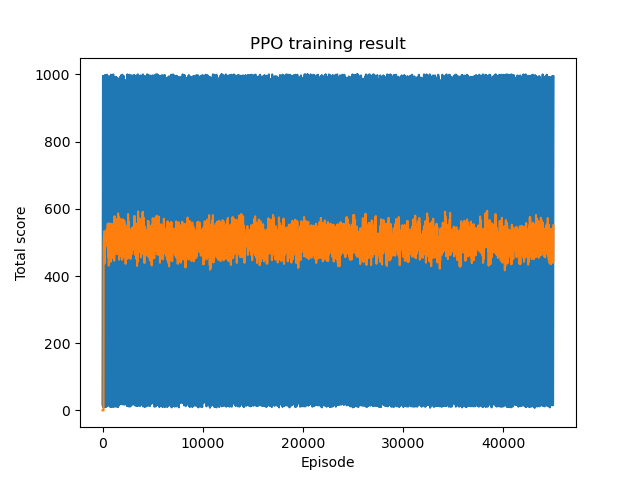

# Actor Critic
A practical Proximal Policy Optimization(PPO) (one Actor Critic) reinforcement learning (RL)implementation and training for the CartPole-v1 environment.

Actor-critic methods in reinforcement learning combine two components: an actor that selects actions and a critic that evaluates the actor's actions. The actor learns a policy to maximize rewards, while the critic learns a value function to assess the quality of those actions. This approach addresses the limitations of purely policy-based (actor-only) or value-based (critic-only) methods. 
PPO is an on-policy Actor-Critic RL algorithm that optimizes a policy (the “actor”) using a value function (the “critic”) while constraining policy updates to prevent large, unstable changes.

## Dependency Management
Use [Conda](https://docs.conda.io/projects/conda/en/latest/user-guide/getting-started.html) to manage the environment and 3rd party libraries.
All the required dependencies are put in requirements.txt.
* Create an environment `conda create -n ac python=3.12`
* Activate the environment `conda activate ac`
* * Install the dependencies 
  * `conda install --yes --file actor_critic/requirements.txt`

## Training
* Components
  * Policy network (Actor): Outputs action probabilities for given state.
  * Value network (Critic): Outputs value estimates for given state.
  * Data collection: Follows the current policy to collect trajectories, stored in a buffer, which is used to compute loss for the policy and value network updates.
  * Advantage estimation: Quantifies how much better a specific action is compared to the average action taken in a given state.
  * Clipped surrogate objective function: prevent overly large policy updates, ensuring that the new policy doesn't deviate too far from the previous one, which can improve training stability. The clipping mechanism limits the range of possible policy changes, essentially creating a "trust region" where the agent can explore without risking significant instability.
  It uses a ratio between the probabilities of actions under the current and previous policies. This ratio is then multiplied by the advantage to obtain the surrogate objective function.
  * Objective function: Policy network is updated by optimizing the clipped surrogate objective function, and value network is updated by minimizing the TD error.

* Train Script Run 
  * Run script directly, `python3 -m actor_critic.train` or just run train.py script in your IDE.
  * One PPO training run result. It represents the total accumulated reward over each training episode.
  A training episode in RL refers to a complete sequence of interactions between an agent and its environment, starting from a specific initial state and ending at a defined termination condition.
  
  

  Compared with DQN and policy gradient training results, the PPO training result is better and more stable.
    
## References
* https://huggingface.co/learn/deep-rl-course/unit8/hands-on-cleanrl
