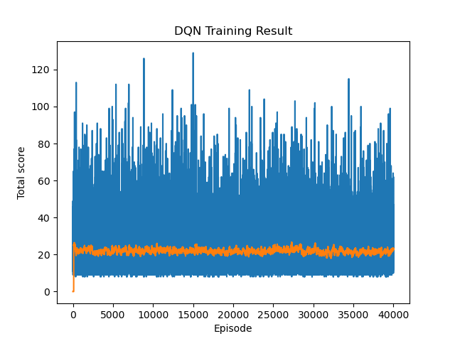

# Deep Q-Network (DQN)
A practical c Deep Q-Network (DQN) implementation, training, and inference for the CartPole-v1 environment.

## Dependency Management
Use [Conda](https://docs.conda.io/projects/conda/en/latest/user-guide/getting-started.html) to manage the environment and 3rd party libraries.
All the required dependencies are put in requirements.txt.
* Create an environment `conda create -n dqn python=3.12`
* Activate the environment `conda activate dqn`
* * Install the dependencies 
  * `conda install --yes --file dqn/requirements.txt`

## Training
* Run script directly, `python3 -m dqn.train` or just run train.py script in your IDE.
* 

## Inference
* Run script directly, `python3 -m dqn.inference` or just run inference.py script in your IDE.

## References
* https://spinningup.openai.com/en/latest/spinningup/rl_intro.html
* https://spinningup.openai.com/en/latest/spinningup/rl_intro2.html
* https://huggingface.co/learn/deep-rl-course/unit2/introduction
* https://pytorch.org/tutorials/intermediate/reinforcement_q_learning.html
* https://www.cs.toronto.edu/~vmnih/docs/dqn.pdf
* https://gym.openai.com/