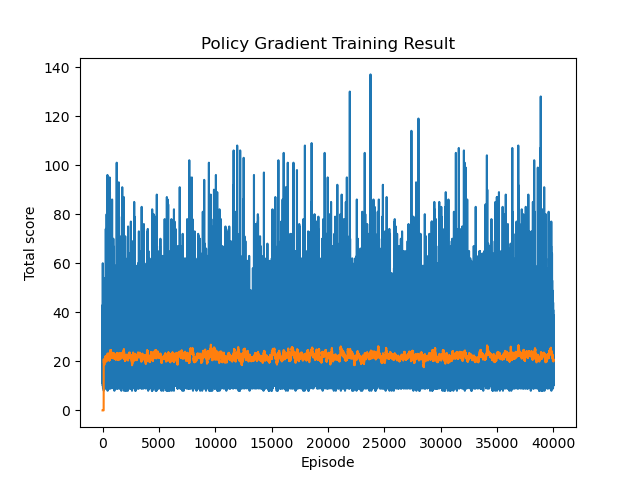

# Policy Gradient method
A practical for policy gradient implementation, training, and evaluation for the CartPole-v1 environment.

Unlike value-based methods that estimate the reward obtained by taking an action given a state, policy Gradient methods are policy-based RL approaches that directly optimize the policy network (a mapping from states to actions) by adjusting its parameters (e.g., neural network weights) to maximize expected rewards.

## Dependency Management
Use [Conda](https://docs.conda.io/projects/conda/en/latest/user-guide/getting-started.html) to manage the environment and 3rd party libraries.
All the required dependencies are put in requirements.txt.
* Create an environment `conda create -n pg python=3.12`
* Activate the environment `conda activate pg`
  * Install the dependencies 
    * `conda install --yes --file policy_gradient/requirements.txt`

## Training
* Components
  * Policy network: Takes a state and outputs a probability distribution over actions. 
  * Policy Gradient: Provides information about the direction and magnitude of change needed to optimize the policy parameters. Its goal is to maximize the expected cumulative reward over the agent's future interactions with the environment.

* Train Script Run
  * Run script directly, `python3 -m policy_gradient.train` or just run train.py script in your IDE.
  * One Policy Gradient training run result. It represents the total accumulated reward over each training episode.
  * A training episode in RL refers to a complete sequence of interactions between an agent and its environment, starting from a specific initial state and ending at a defined termination condition.
  
  

## References
* https://huggingface.co/learn/deep-rl-course/unit4/hands-on
